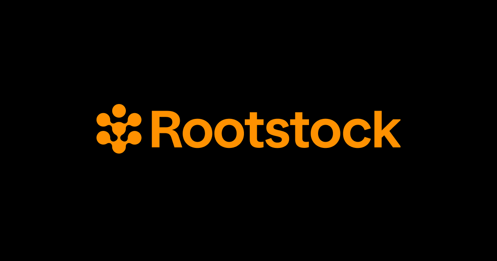

[](https://scorecard.dev/viewer/?uri=github.com/rsksmart/reown-next-starter-kit)
[](https://github.com/rsksmart/reown-next-starter-kit/actions?query=workflow%3ACodeQL)



# Rootstock Reown AppKit Example using wagmi (Next.js with App Router)

**⚠️ Warning: This is a starter kit designed for hackathons and rapid prototyping. It is intended for educational and experimental purposes only. Use it at your own risk, and ensure thorough testing before deploying in production environments.**

This project demonstrates the integration of [Reown's AppKit](https://docs.reown.com/appkit/next/core/installation) with a Next.js application utilizing the App Router. The wagmi library provides essential hooks for interacting with wallets like MetaMask and WalletConnect, allowing developers to focus on building their decentralized applications (dApps) rather than managing low-level blockchain interactions.

For more details on Embedded Wallets, explore the official [Reown Documentation](https://docs.reown.com/), which offers further insights into wallet management and features.

## Prerequisites

Ensure that you have the following tools installed:

- [Node.js](https://nodejs.org/) (v19.x or later)
- [Bun](https://bun.sh/) (v1.1.x or later) or [Yarn](https://yarnpkg.com/) (recommended for Next.js projects)

## How to Use

1. **Clone the Repository**

   ```bash
   git clone https://github.com/rsksmart/reown-next-starter-kit.git
   cd reown-next-starter-kit
   ```

2. **Install Dependencies**

   ```bash
   yarn install # or bun install
   ```

3. **Configure Environment Variables**

   - Rename `.env.example` to `.env.local`.

   - Obtain your `Project ID` from [Reown Cloud](https://cloud.reown.com) and add it to the `.env.local` file.

   - Add your `Rootstock Mainnet RPC URL` and `Rootstock Testnet RPC URL` to the `.env.local` file. Get your RPC from [RPC API](https://dashboard.rpc.rootstock.io/dashboard)

4. **Run the Application**

   ```bash
   yarn dev # or bun run dev
   ```

## Contributors

- **flash** ([@flash](https://github.com/chrisarevalo11))

## Troubleshooting

- **RPC Connection Issues**: Verify that the RPC URLs are reachable and correct.
- **Wallet Connection Issues**: Check if MetaMask is installed and the wallet is connected to the Rootstock Testnet.

## Contributing

We welcome contributions from the community. Please fork the repository and submit pull requests with your changes. Ensure your code adheres to the project's main objectives.

## Support

For any questions or support, please open an issue on the repository or reach out to the maintainers.

## Disclaimer

The software provided in this GitHub repository is offered “as is,” without warranty of any kind, express or implied, including but not limited to the warranties of merchantability, fitness for a particular purpose, and non-infringement.

- **Testing**: The software has not undergone testing of any kind, and its functionality, accuracy, reliability, and suitability for any purpose are not guaranteed.
- **Use at Your Own Risk**: The user assumes all risks associated with the use of this software. The author(s) of this software shall not be held liable for any damages, including but not limited to direct, indirect, incidental, special, consequential, or punitive damages arising out of the use of or inability to use this software, even if advised of the possibility of such damages.
- **No Liability**: The author(s) of this software are not liable for any loss or damage, including without limitation, any loss of profits, business interruption, loss of information or data, or other pecuniary loss arising out of the use of or inability to use this software.
- **Sole Responsibility**: The user acknowledges that they are solely responsible for the outcome of the use of this software, including any decisions made or actions taken based on the software’s output or functionality.
- **No Endorsement**: Mention of any specific product, service, or organization does not constitute or imply endorsement by the author(s) of this software.
- **Modification and Distribution**: This software may be modified and distributed under the terms of the license provided with the software. By modifying or distributing this software, you agree to be bound by the terms of the license.
- **Assumption of Risk**: By using this software, the user acknowledges and agrees that they have read, understood, and accepted the terms of this disclaimer and assume all risks associated with the use of this software.
